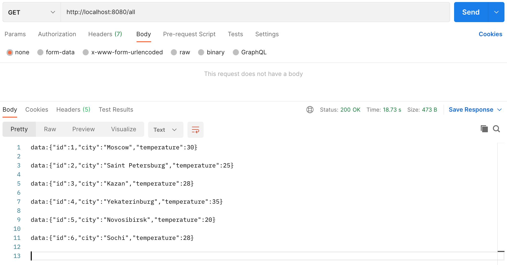
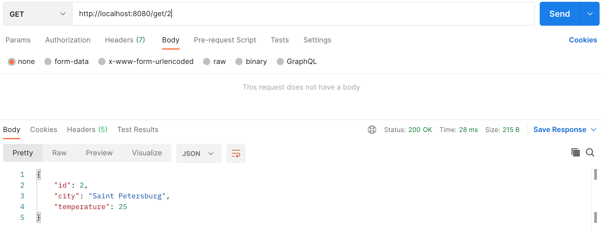
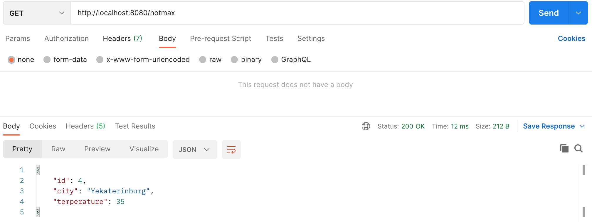
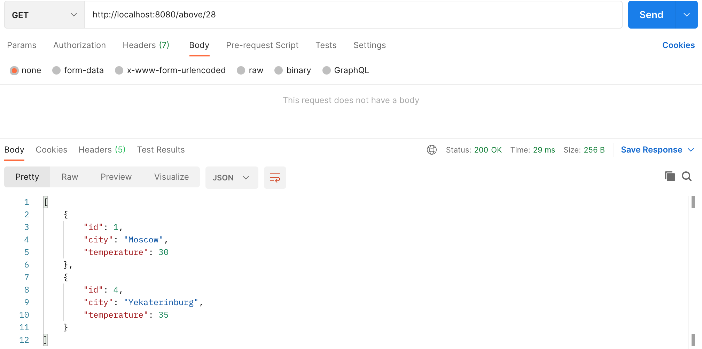

## Проект курса [job4j](http://job4j.ru)

### Reactive

Приложение работает в реактивном стиле

Технологии:
- PostgresSQL
- Hibernate
- Spring Data / WebFlux / Web / Rest 
- Singleton

Получить все города http://localhost:8080/all

Получить город по ID http://localhost:8080/get/{id}

Получить город с максимальной температурой http://localhost:8080/hotmax

Получить города c температурой выше указанной http://localhost:8080/above/{temperature}
